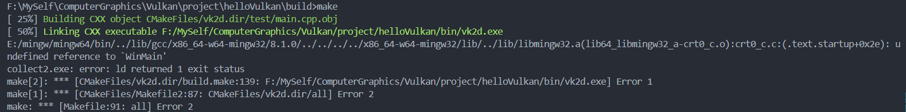
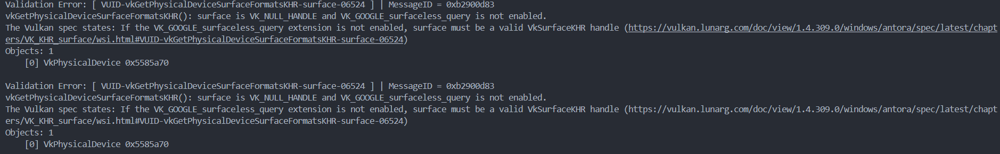

# A simple Vulkan learning project

### The Problems Shooting
- undefined reference to 'WinMain'

> how to solve this problem?
>
> main is define in SDL_vulkan.h
>
> as #define main SDL_main
>
> so we need to undefine it and use our own main function

- VK_NULL_HANDLE for surface

> how to solve this problem?
> 
> don't forget to pass surface to get formats
>
> `auto formats = physical_device.getSurfaceFormatsKHR(surface);`
>
> cuz the function can also take 0 argument, and complier won't tell you the null pointer error.
